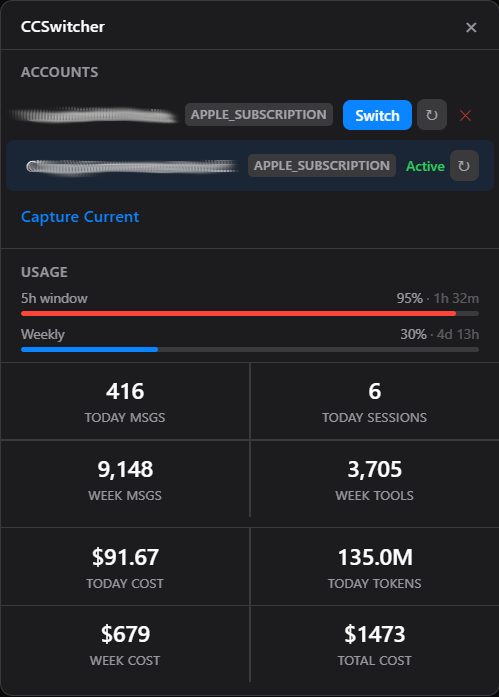

# CCSwitcher for Windows

A Windows system-tray app for switching between multiple [Claude Code](https://claude.ai/code) accounts without logging out each time.



## Features

- **Account switching** — swap Claude Code credentials in one click; no manual `claude auth logout / login` cycle
- **Usage dashboard** — 5-hour session and weekly rate-limit bars with reset countdown
- **Cost tracking** — today's and weekly API-equivalent cost parsed from local JSONL logs
- **Activity stats** — message counts, session counts, tool calls
- **Encrypted backups** — per-account credentials stored with Electron `safeStorage` (OS-level encryption)

## How it works

Claude Code stores its active credentials in two files:

| File | Contents |
|------|----------|
| `~/.claude/.credentials.json` | OAuth access + refresh token |
| `~/.claude.json` | `oauthAccount` identity block |

CCSwitcher reads these files, backs up each account's credentials, and swaps them atomically when you switch. The active account is verified by re-reading `oauthAccount.emailAddress` after every write.

Usage limits are fetched from `https://api.anthropic.com/api/oauth/usage` using Electron's Chromium network stack (bypasses Cloudflare TLS-fingerprint filtering that blocks Node.js `https`).

## Getting started

### Prerequisites

- Windows 10 or later
- [Claude CLI](https://claude.ai/code) installed and at least one account logged in
- Node.js 18+ (development only)

### Add your first account

1. Log in to Claude Code in a terminal:
   ```
   claude auth login
   ```
2. Launch CCSwitcher (system tray icon appears).
3. Click the tray icon → **Capture Current**.

### Add a second account

```
claude auth logout
claude auth login          # log in as account B
```

Then click **Capture Current** again. Switch between accounts from the tray popup.

## Development

```bash
npm install
npm run dev       # hot-reload dev window
```

```bash
npm run build     # compile to out/
npm run dist      # build NSIS installer → dist/
```

### Project structure

```
src/
  main/
    index.ts              # Electron entry, tray setup
    popup.ts              # Borderless popup window
    ipc.ts                # IPC handler registration
    services/
      accounts.ts         # Account switching & credential backup
      claude.ts           # Claude CLI detection & auth status
      credential.ts       # File-based credential read/write
      usage.ts            # Usage API fetch + token refresh
      stats.ts            # Local JSONL log parser
      pricing.ts          # LiteLLM pricing table
  preload/
    index.ts              # contextBridge API surface
  renderer/
    src/
      App.tsx             # Root component, data fetch orchestration
      components/
        AccountList.tsx   # Account rows + switch/capture/remove
        UsagePanel.tsx    # Rate-limit bars, stats grid, cost cells
      styles.css
  shared/
    types.ts              # Shared TypeScript interfaces
```

## Re-authentication

If an account's token expires and automatic refresh fails, click **↻** next to the account:

1. In a terminal, run `claude auth login` and log in as that account.
2. Click **↻** (Re-authenticate) in CCSwitcher — it reads the fresh token and updates the backup.

## Notes

- CCSwitcher does **not** run `claude auth login` itself; the browser-redirect OAuth flow requires an interactive terminal on Windows.
- Credential backups are encrypted with `safeStorage` and stored in `%APPDATA%\CCSwitcher\backups.json`. Deleting that file removes all backups.
- Usage limits are only available for OAuth accounts (Pro / Max). API-key accounts will show no rate-limit bars.
